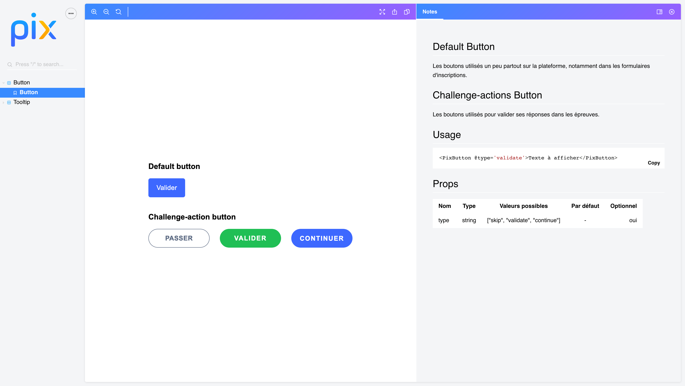

- [Présentation de Pix-UI](#Pix-UI)
- [Installation de l'addon Pix-UI](#Addon)
- [Développment de Pix-UI](#Developpement)
  - [Lancement de storybook en local](#Storybook)
  - [Création d'un composant](#Composant)
- [Documentations](#Documentation)

Pix-UI 
==============================================================================

Pix-UI c'est l'implémentation des principes du design system de Pix. Cela se matérialise par :
- **un addon ember**, permettant l'utilisation composants UI Pix sur des applications ember externes
- **un site statique**, présentant les composants UI Pix : https://1024pix.github.io/pix-ui/

##### Version du projet : 

* Ember CLI v3.17
* Node 12.14.1

## Installation de l'addon Pix-UI 

Pour utiliser les composants sur une application Ember externe, il faut installer l'addon ember Pix-UI avec la commande : 
- `npm install git://github.com/1024pix/pix-ui.git#<tag_souhaité>`

##### Quel tag choisir ?

`<tag_souhaité>` doit correspondre au numéro de version à installer. Ce numéro de version correspond à une release.
*Par exemple, on peut remplacer `<tag_souhaité>` par `v0.1.1`.*
Pour voir la liste des tags de Pix-UI, [c'est par ici.](https://github.com/1024pix/pix-ui/tags)

##### Installation par défaut

Il est possible d'installer Pix UI sans `#<tag_souhaité>`, auquel cas ce sera la dernière version qui sera installée. 

Plus d'informations sur les [tags git ici](https://git-scm.com/book/fr/v2/Les-bases-de-Git-%C3%89tiquetage).

## Développement de Pix-UI 

* `git clone https://github.com/1024pix/pix-ui.git`
* `cd pix-ui`
* `npm install`

##### Lancement de storybook en local 

Pour visualiser les composants créés, il faut lancer storybook :
* `npm run storybook`

##### Création d'un composant et sa story 

Pour créer un composant ainsi que sa story :
* `ember generate pix-component <nom_du_composant>`
[Voir la documentation par ici.](/docs/create-component.md)

## Documentations 

- [Architecture de Pix-UI](/docs/project-architecture.md)
- [Faire une release de Pix-UI](/docs/make-a-release.md)
- [Bonnes pratiques de développement sur Pix-UI](/docs/good-practices-on-pix-ui.md)
- [Créer un composant et sa story](/docs/create-component.md)
- [Déploiement de Storybook sur les Github Pages](/docs/storybook-deployment-on-gh-pages.md)

